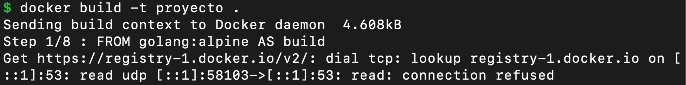

# Servidor web en Go y Dockerfile

En este directorio se encuentran los archivos:

* [proyecto.go](proyecto.go), este archivo contiene la implementación de un servidor HTTP en el lenguaje de programación Go.

* [Dockerfile](Dockerfile), este archivo permite la creación de una imagen de Docker que al ejecutarse crea un contenedor que ejecuta un servidor web.

* [haproxy.cfg](haproxy.cfg), este archivo contiene la configuración básica del balanceador de carga HAProxy. **Este archivo debe ajustarse para reflejar los IPs de sus contenedores**.

---

## Compilación y ejecución de `proyecto.go`

Para compilar el programa `proyecto.go` se ejecuta el comando:

```
go build proyecto.go
```

Esto genera un archivo llamado `proyecto`. 
Se ejecuta desde la terminal:

```
./proyecto
```

Ahora, usted puede abrir un navegador que vaya al url [http://localhost:8000](http://localhost:8000).

---

## Creación de imagen `proyecto`

Para crear la imagen que indica la presentación ejecute el siguiente comando:

```
docker build -t proyecto .
```

Para ejecutar un contenedor a partir de la imagen anterior ejecute el siguiente código:

```
docker run proyecto
```

---

## Comandos ejecutados al interior de la presentación

* `go build proyecto.go` &#8594; compila el programa `proyecto.go`

* `docker build -t proyecto .` &#8594; crea la imagen con la aplicación en Go.
Si durante el proceso de creación de la imagen obtiene un error como el siguiente:

Ejecute primero `docker pull alpine` y luego si ejecute el comando `docker build -t proyecto .`.

* `docker run proyecto`  &#8594; comando para ejecutar la imagen creada en el punto anterior.

* `docker run -d proyecto`  &#8594; comando similar al anterior solo que esta vez el contenedor queda ejecutandose como un `daemon`.

* `docker inspect $(docker ps -q) -f {{range.NetworkSettings.Networks}}{{.IPAddress}}{{end}}" - "{{.Name}}`  &#8594; comando que muestra los IPs de los diferenes contenedores.

* `docker run -v $(pwd):/usr/local/haproxy -p 80:80 haproxy`  &#8594; comando para ejecutar el balanceador de carga [haproxy](http://www.haproxy.org/).

* `docker stop $(docker ps -q)`  &#8594; comando para detener la ejecución de todos los contenedores.

* `docker rm -f $(docker ps -aq)`  &#8594; comando para borrar todos los contenedores, se hayan detenido o no.

* `docker rm -f $(docker ps -f status=exited -q)`  &#8594; comando para borrar aquellos contenedores que se hayan detenido únicamente.

* `docker rmi -f $(docker images -q)`  &#8594; comando para borrar todas las imágenes de Docker.
